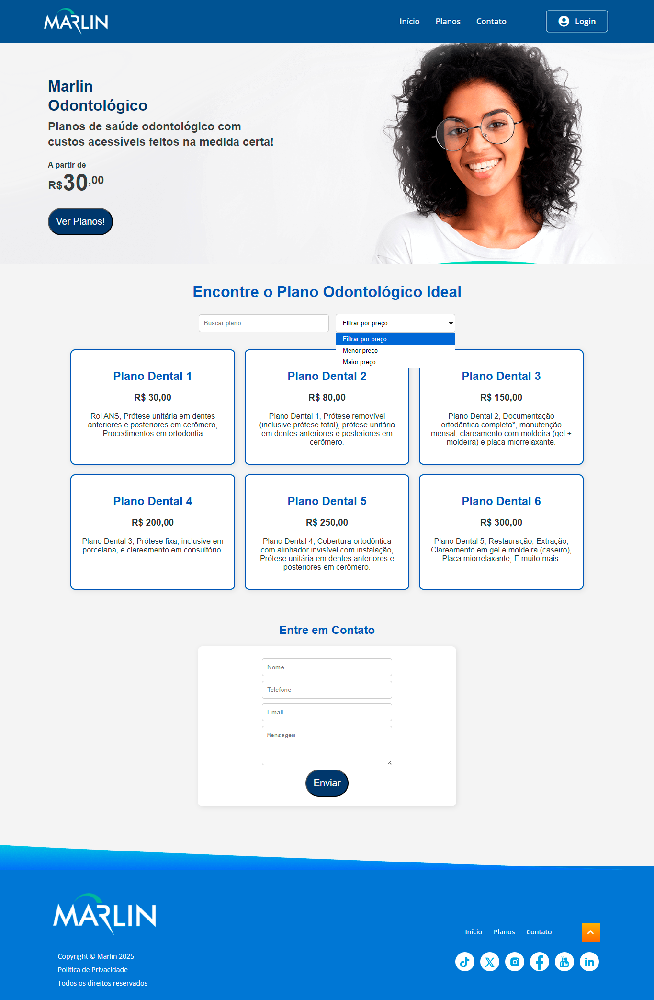
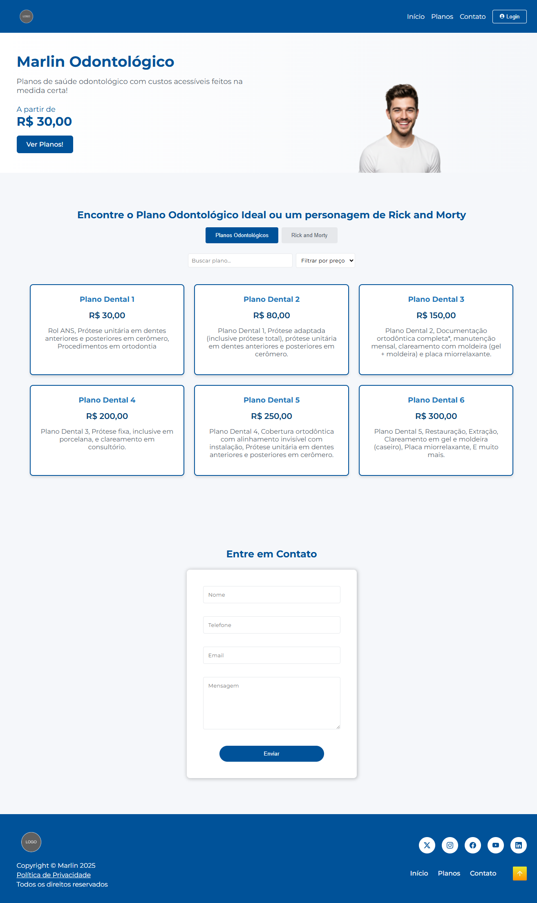
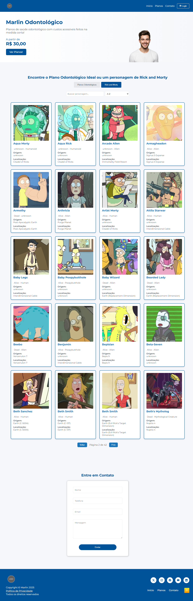

# Desafio Técnico Marlin - Angular 19

Este projeto foi desenvolvido como parte de um desafio técnico de Frontend com foco em Angular. O objetivo foi criar uma **página única (OnePage)** responsiva para exibir **planos odontológicos**, com funcionalidades de **busca**, **filtro** e **integração com uma API REST simulada (JSON local)**.

---

## 📸 Layout Base

O layout implementado foi baseado na imagem fornecida no desafio:


---

## 🚀 Funcionalidades

- 🔍 Busca de planos odontológicos por nome e ordenação por valor
- 📡 Consumo de API REST simulada via JSON local
- 📱 Layout responsivo
- 🧼 Código modularizado e comentado

---

## 🛠️ Tecnologias Utilizadas

- ✅ [Angular 19](https://angular.io/)
- ✅ HTML5 (semântica e boas práticas de SEO)
- ✅ SCSS (estilização personalizada e responsiva)
- ✅ TypeScript
- ✅ JSON local como mock da API REST
- ✅ [Jest](https://jestjs.io/) para testes unitários

---

## ▶️ Como Rodar o Projeto

Siga os passos abaixo para configurar e executar o projeto em seu ambiente de desenvolvimento.

### Instalação

1.  **Clone o repositório:**

    ```bash
    git clone https://github.com/matheudsp/desafio-tecnico-marlin-angular.git
    ```

2.  **Navegue até o diretório do projeto:**

    ```bash
    cd desafio-tecnico-marlin-angular
    ```

3.  **Instale as dependências:**
    ```bash
    npm install
    ```

### Executando a Aplicação

1.  **Inicie o servidor de desenvolvimento:**

    ```bash
    ng serve
    ```

    Ou, se preferir especificar a porta e abrir automaticamente no navegador:

    ```bash
    ng serve -o --port 4200
    ```

2.  **Acesse no navegador:**
    Abra seu navegador e vá para `http://localhost:4200/`. A aplicação será recarregada automaticamente se você alterar qualquer um dos arquivos de origem.

---

## 🧪 Rodando os Testes

Este projeto utiliza Jest para testes unitários. Para executar os testes, siga os passos abaixo:

1.  **Execute o comando de teste:**
    No diretório raiz do projeto, rode o seguinte comando no terminal:
    ```bash
    npm run test
    ```
    Isso iniciará o executor de testes Jest.

---

## 📸 Imagens

Imagens do projeto desenvolvido:

<p align="center" >
  
  
</p>

---

## 👨‍💻 Autor

**Matheus de Sousa Pereira**

- GitHub: [@matheudsp](https://github.com/matheudsp)
- LinkedIn: [Matheus Pereira](https://www.linkedin.com/in/matheudsp/)
